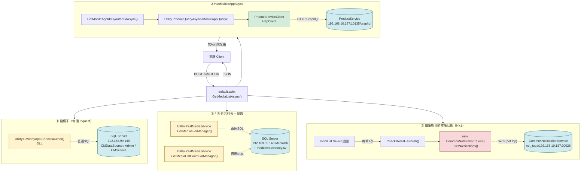

# getMediaListAsync() 外部依賴清單

> 對應程式碼：`member/App_Code/AshxCs/Author/Default.cs::GetMediaListAsync()` (line 1611)
> 用途：新架構（非 `.ashx`）重寫前，先盤點所有需要對接的外部服務

---

## 呼叫流程圖



圖例：
- 🟡 黃色 = DLL 呼叫（in-process）
- 🟢 綠色 = HTTP
- 🔴 紅色 = WCF net.tcp
- 🔵 藍色 = 外部端點 / DB

---

## 索引

| # | 呼叫位置 | 服務 | 協定 | 端點 |
|---|---------|------|------|------|
| 1 | 建構子 @ line 278 | CMoneyApp.CheckIsAuthor | DLL → SQL Server | `192.168.99.148`（CMDataSource 等 5 個 DB） |
| 2 | HasMobileAppAsync @ line 1620 | ProductService | HTTP POST GraphQL | `http://192.168.10.187:10135/graphql` |
| 3 | GetMediasForManager @ line 1675 | RealMediaService | DLL → SQL Server | `192.168.99.148`（MediaDb）+ `mediatest.cmoney.tw` |
| 4 | GetMediaListCountForManager @ line 1683 | RealMediaService | DLL → SQL Server | 同 3 |
| 5 | CheckMediaHasPush @ line 2401（每筆影音呼叫 1 次，N+1） | CommonNotificationService | **WCF net.tcp** | `net.tcp://192.168.10.187:20028/CommonNotificationService` |

---

## 1. CheckIsAuthor（建構子，每個 request 都跑）

| 項目 | 內容 |
|------|------|
| 協定 | DLL（`BackendComponent.GeneralFunction.CMoneyApp`） → 直連 SQL Server |
| 實際位置 | `Utility.cs:307` 初始化 `new CMoneyApp(...)` |
| DB 連線 | `CMDataSource=192.168.99.148`、`CMDataSource2`、`CMDataSourceLog`、`Admin`、`CMService`（user=`iisap`） |
| 呼叫 | `Utility.CMoneyApp.CheckIsAuthor(LoginMemberId, out errorMsg)` |
| Input | `int memberId` |
| Output | `bool IsAuthor`, `out string errorMsg` |

> 新架構備註：這是 DLL 直接打 SQL，沒有 HTTP 介面。新服務要嘛繼續 reference DLL、要嘛需要 CMoneyApp 包一層 API。

---

## 2. ProductService（GraphQL）— 判斷有沒有行動 App

呼叫鏈：

```
HasMobileAppAsync (line 3767)
  └─ GetMobileAppIdsByAuthorIdAsync(authorId) (line 633)
       └─ Utility.ProductQueryAsync<MobileAppQuery>(graphQL, { authorId })
            └─ ProductServiceClient.ProductQueryAsync (HttpClient POST)
```

| 項目 | 內容 |
|------|------|
| 協定 | HTTP POST, `Content-Type: application/json` |
| URL | `http://192.168.10.187:10135/graphql`（base 來自 appSettings `ProductServiceUrl`） |
| Header | `x-api-key: {FromSite}` |
| Input | ```json { "Query": "query($authorId: Int) { mobileAppSet(status:1, authorId:$authorId) { id } }", "Variables": { "authorId": 123 } } ``` |
| Output | `{ "data": { "mobileAppSet": [ { "id": 2 }, { "id": 6 } ] } }` |
| 判斷邏輯 | `mobileAppSet.Length > 0` 即視為「有 App」 |

---

## 3. RealMediaService.GetMediasForManager — 影音列表

| 項目 | 內容 |
|------|------|
| 協定 | DLL（`CMoney.WebBackend.RealMediaService`） → 直連 SQL Server |
| 實際位置 | `Utility.cs:166` `new RealMediaService(Setting.Media.IP, User, Password, LinuxMediaServerIP, FromSite)` |
| DB / Server | `MediaDbAddress=192.168.99.148`（user=`iisap`）+ Linux 檔案伺服器 `mediatest.cmoney.tw` |
| Input（`MediaManagerSelectRequirement`） | `ChannelId`、`DisplayPlatform=Mobile`（固定）、`ShowSize=fetchConut`、`SkipSize=skipCount`、`SortRuleType=CreateTimeDesc`、`ActiveType=All`、`MediaSaleTypeList=[Free,Gift]`（或單一）、`DisplayMobileId=0`、`AuthorMemberId`、`SourceTypeList=[YoutubeUrlParameter, CmoneyLocalFile]` |
| Output | `List<MediaInfoObj>` + `out int errorCode, out string errorMessage` |
| MediaInfoObj 用到的欄位 | `MediaId, MediaName, MediaSaleType, CreateTime, Status, CountOfView` |

---

## 4. RealMediaService.GetMediaListCountForManager — 總筆數

| 項目 | 內容 |
|------|------|
| 協定 | 同 3（DLL → SQL） |
| Input | 同 3 的 `MediaManagerSelectRequirement` |
| Output | `int count` + `out errorCode, out errorMessage` |
| 備註 | 與 3 是**相同條件掃兩次 DB**，是已知待優化點 |

---

## 5. CommonNotificationService（WCF）— 推播狀態

呼叫於 `CheckMediaHasPush` (line 2401)，**目前在 `roomList.Select()` 裡每一筆都 new 一個 client 呼叫一次，是 N+1 的元兇**。

| 項目 | 內容 |
|------|------|
| 協定 | **WCF `netTcpBinding`** |
| URL（正式） | `net.tcp://192.168.10.187:20028/CommonNotificationService` |
| URL（測試） | `net.tcp://testiis:20028/CommonNotificationService` |
| Contract | `CommonNotificationService.ICommonNotification` |
| Binding 設定 | `maxReceivedMessageSize=2147483647` |
| 呼叫的方法 | `GetNotifications(targetType, targetId, pushTitle, pushContent, skipCount, fetchCount)` |
| Input | `CommonPushTargetType.Media`, `targetId=0`, `pushTitle="【全新影音上架】快來點擊觀看！"`, `pushContent=mediaName`, `skipCount=0`, `fetchCount=50` |
| Output | `CommonNotificationInfo[]`，每筆含 `HadNotified`(bool)、`CommonParam`(JSON 字串，內含 `mediaId`) |
| 判斷 hasPush | 找不到 → `None(0)`；找到 `HadNotified=true` → `Pushed(2)`；`false` → `Pushing(1)` |
| 優化後版本 | 改呼叫 `GetCommonNotifications(targetType=Media, skip=0, fetch=10000)` 一次拉全部，記憶體建 Map |

---

## 新架構要問的問題

1. **`RealMediaService`（影音 DB 操作）** 新架構會不會有對應的 HTTP/gRPC 服務？還是新服務要自己讀 Media DB？
2. **`CMoneyApp.CheckIsAuthor`** 作者身分驗證要不要抽成獨立的 Auth/Author API？
3. **`CommonNotificationService`** 有沒有 HTTP 版？新服務還要繼續吃 WCF net.tcp 嗎？
4. **ProductService GraphQL** 這個已經是 HTTP 了，應該可以直接沿用。
